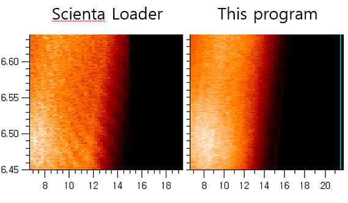

# ARTOF 10k data loader
 You can load ARTOF streamed data very fast since main calculation part is written in C. The 'jittering' is occuring at the Scienta data loader since the loaser processes non-linear converion of binned data without interpolation. I improved the algorithm to prevent the jittering.
